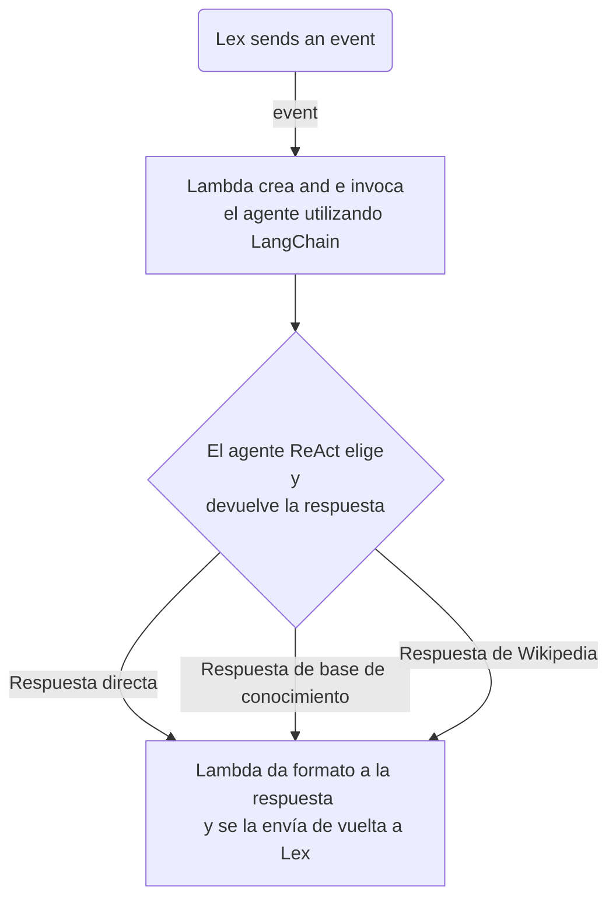

# 🤖 AI Chatbot con AWS y LangChain

_Social_

_Servicios usados_

    

## 📋 Resumen

Este proyecto crea un chatbot inteligente que genera respuestas automáticas utilizando inteligencia artificial generativa y una base de conocimiento dinámica. La solución integra varios servicios de Amazon Web Services (AWS) y utiliza las bibliotecas de [**LangChain**](https://github.com/langchain-ai/langchain) y la [**API de Wikipedia**](https://github.com/martin-majlis/Wikipedia-API) para enriquecer las respuestas.

## 🤔 IA Generativa con RAG

Se ha implementado un agente de IA de tipo [**ReAct Agent**](https://react-lm.github.io/ "Ir a explicación de React Agent") que utiliza la técnica de [**Retrieval Augmented Generation (RAG)**](https://aws.amazon.com/what-is/retrieval-augmented-generation/ "Ir a explicación de RAG") para proporcionar respuestas precisas y actualizadas. Este agente interactúa con dos herramientas clave:

* **Base de conocimiento**: Emplea RAG para recuperar información relevante sobre temas específicos, como por ejemplo, datos salariales de una empresa.
* **Wikipedia**: Usa la API de Wikipedia para acceder a una amplia gama de información, enriqueciendo las respuestas con datos precisos y variados.

## ☁️ Servicios de AWS Utilizados

La solución se apoya en varios servicios de AWS para garantizar una integración fluida y un costo eficiente. Los servicios principales son:

* [**📁 S3**](https://aws.amazon.com/s3 "Ir a S3"): Almacena los archivos .pdf que contienen la información estructurada que el chatbot utiliza para generar respuestas claras y precisas.
* [**💬 Lex**](https://aws.amazon.com/lex/ "Ir a Lex"): Proporciona la interfaz de usuario para el chatbot, incluyendo servicios de voz como Amazon Transcribe y Amazon Polly.
* [**🧠 Bedrock**](https://aws.amazon.com/bedrock/ "Ir a Bedrock"): Actúa como el centro de selección de modelos fundacionales (FM) y alberga la base de conocimiento.
* [**⚙ Lambda**](https://aws.amazon.com/lambda/ "Ir a Lambda"): Funciona como un servicio serverless que facilita las llamadas al agente de IA y sus herramientas, ofreciendo escalabilidad automática, seguridad y flexibilidad.

## 📚 Bibliotecas y Herramientas

* [**🦜️🔗 LangChain**](https://github.com/langchain-ai/langchain "Ir a LangChain"): Permite la integración y orquestación de diferentes herramientas de IA y bases de conocimiento, facilitando la creación de un agente de IA robusto.
* [**🌍 Wikipedia-API**](https://github.com/martin-majlis/Wikipedia-API "Ir a Wikipedia-API"): Proporciona acceso a datos extensos y actualizados de Wikipedia, enriqueciendo las capacidades del chatbot.

## 🚀 Descripción del Funcionamiento

El flujo general del chatbot es el siguiente:

* **Recepción del Evento**: AWS Lambda recibe un evento de Amazon Lex.
* **Generación de la Respuesta**: Lambda llama al agente de IA que utiliza LangChain para procesar el evento.
* **Consulta a la Base de Conocimiento**: El agente emplea RAG para buscar información en la base de conocimiento alojada en Amazon Bedrock.
* **Acceso a Wikipedia**: En caso de requerir información adicional, el agente consulta la Wikipedia utilizando su API.
* **Respuesta al Usuario**: La respuesta generada se formatea y se envía de vuelta a Amazon Lex, que la presenta al usuario.

