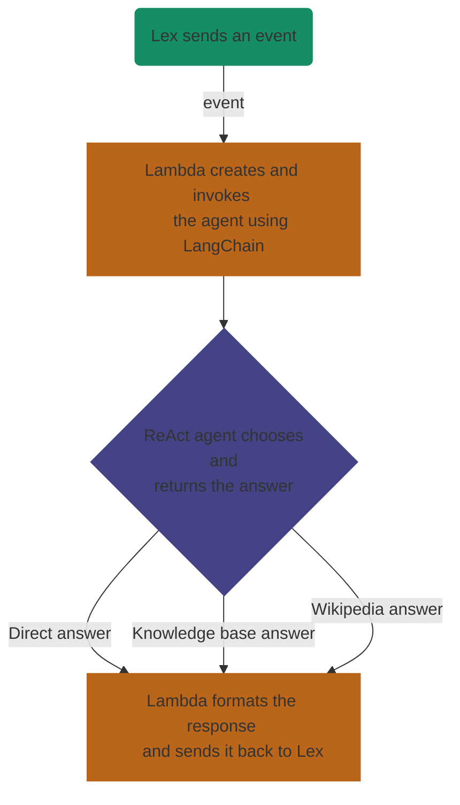

# 🤖 AI Chatbot with LangChain and AWS

_Social_

[](https://github.com/565059 "Go to 565059's GitHub") [](https://www.linkedin.com/in/luis-fern%C3%A1ndez-castelo-06358025b)[](https://twitter.com/56_50_59)

_Services used_

[](https://www.python.org/downloads/release/python-3120/ "Go to Python") [](https://github.com/langchain-ai "Go to LangChain") [](https://github.com/martin-majlis/Wikipedia-API "Go to Wikipedia-API") [](https://github.com/boto/boto3 "Go to Boto3") 

## 📋 Summary

This project develops an intelligent chatbot that generates automatic responses using generative artificial intelligence and a dynamic knowledge base. The solution integrates various Amazon Web Services (AWS) and leverages the [**LangChain**](https://github.com/langchain-ai/langchain "Go to LangChain") libraries and the [**Wikipedia API**](https://github.com/martin-majlis/Wikipedia-API "Go to Wikipedia-API") to enrich responses.

## 🤔 Generative AI with RAG

A [**ReAct Agent**](https://react-lm.github.io/ "Go to ReAct Agent explanation") has been implemented, utilizing the [**Retrieval Augmented Generation (RAG)**](https://aws.amazon.com/what-is/retrieval-augmented-generation/ "Go to RAG explanation") technique to provide accurate and up-to-date responses. This agent interacts with two key tools:

* **Knowledge Base Tool**: we first create the knowledge base using **Amazon Titan Embeddings** as the embeddings model and **Pinecone** as the vector database in which the indexed embeddings will be stored. Then, we create the knowledge base tool using the `create_retriever_tool` method from **LangChain** transforming our retriever into a `Tool` object so that the agent can access it and execute it.

  ```python
  from langchain.tools.retriever import create_retriever_tool

  retriever_tool = create_retriever_tool(
    name="Knowledge Base",
    description="With this tool you can access a custom knowledge base.",
    retriever=kb_retriever
  )
  ```

* **Wikipedia Tool**: using the same `Tool` class from before, and the `from_function` function, we create the Wikipedia tool from a custom function that checks first if the Wikipedia page exists, if it does, then the API summarizes the desired page.

  ```python
  import wikipediaapi
  from langchain.agents.tools import Tool
  
  def search_wikipedia(self, title):
    wiki_wiki = wikipediaapi.Wikipedia('SampleProject/0.0 (example@example.com)', 'en')
    page = wiki_wiki.page(title)
        
    if page.exists():
      tools_logger.info(f"TOOLS: Page found:\n{page.summary}")
      return page.summary 
    else:
      tools_logger.info("TOOLS: Page not found in Wikipedia")
      return "No page was found on Wikipedia matching your search."

  
  wikipedia_tool = Tool.from_function(
    func=self.search_wikipedia,
    name="Wikipedia",
    description="With this tool you can access Wikipedia to summarize different topics that you don't know."
  )
  ```

## ☁️ AWS Services Used

The solution relies on several AWS services to ensure smooth integration and cost efficiency. The main services are:

* [**📁 S3**](https://aws.amazon.com/s3 "Go to Amazon S3"): Stores .pdf files containing structured information that the **knowledge base tool** uses to generate clear and precise responses.
* [**💬 Lex**](https://aws.amazon.com/lex/ "Go to Amazon Lex"): Provides the user interface for the chatbot, including voice services like **Amazon Transcribe** and **Amazon Polly**.
* [**🧠 Bedrock**](https://aws.amazon.com/bedrock/ "Go to Amazon Bedrock"): Acts as the hub for foundational model (FM) selection and as the host for the **knowledge base**.
* [**⚙ Lambda**](https://aws.amazon.com/lambda/ "Go to Amazon Lambda"): Functions as a serverless service facilitating calls to the AI agent and its tools, offering automatic scalability, security, and flexibility.

## 📚 Libraries and Tools

* [**🦜️🔗 LangChain**](https://github.com/langchain-ai/langchain "Go to LangChain repository"): Enables the integration and orchestration of different AI tools and knowledge bases, making the creation of a robust AI agent easier.
* [**🌍 Wikipedia-API**](https://github.com/martin-majlis/Wikipedia-API "Go to Wikipedia-API repository"): Provides access to extensive and updated data from Wikipedia, expanding the chatbot's capabilities.

## 🚀 Functionality Description

The general flow of the chatbot is as follows:

* **Event Reception**: AWS Lambda receives an event from Amazon Lex.
* **Response Generation**: Lambda calls the AI agent that uses LangChain to process the event.
* **Knowledge Base Query**: The agent employs RAG to search for information in the knowledge base hosted on Amazon Bedrock.
* **Access to Wikipedia**: If additional information is needed, the agent queries Wikipedia using its API.
* **User Response**: The generated response is formatted and sent back to Amazon Lex, which presents it to the user.


